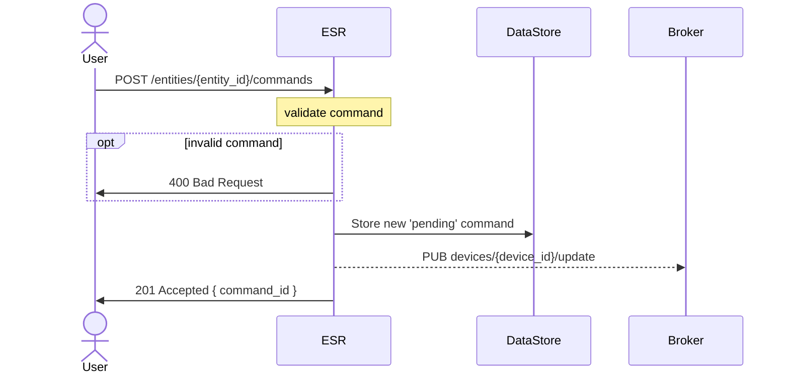

# New Command

```mermaid
sequenceDiagram
    actor User
    participant ESR
    participant DataStore
    participant Broker

    User->>ESR: POST /entities/{entity_id}/commands
    
    note over ESR: validate command
    
    opt invalid command
        ESR->>User: 400 Bad Request
    end

    ESR->>DataStore: Store new 'pending' command

    ESR-->>Broker: PUB devices/{device_id}/update

    ESR->>User: 201 Accepted { command_id }
```